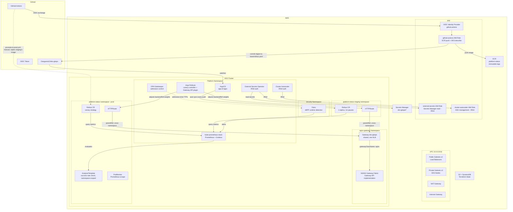

# Kubernetes GitOps Platform — AWS EKS

> Production-grade DevSecOps platform on AWS EKS. Demonstrates supply-chain security, GitOps delivery, progressive canary deployments, and policy-as-code — with zero long-lived cloud credentials in CI.

[](https://github.com/Oseguera12/eks-gitops/actions/workflows/ci-cd.yml)
[](https://github.com/Oseguera12/eks-gitops/actions/workflows/terraform.yml)

## Table of Contents

- [Quick Start](#quick-start)
- [Demo Session Runbook](#demo-session-runbook)
- [Initial Setup](#initial-setup)
- [Executive Summary](#executive-summary)
- [System Overview](#system-overview)
- [Architecture Diagram](#architecture-diagram)
- [Technologies](#technologies)
- [Cloud Resource Requirements](#cloud-resource-requirements)
- [Validation](#validation)
- [Teardown](#teardown)
- [Configuration Reference](#configuration-reference)
- [Project Directory Structure](#project-directory-structure)
- [CI/CD Pipeline](#cicd-pipeline)
- [Infrastructure Overview](#infrastructure-overview)
- [Monitoring & Observability](#monitoring--observability)
- [Security Considerations](#security-considerations)
- [Authentication & Authorization](#authentication--authorization)
- [Progressive Delivery](#progressive-delivery)
- [Multi-Environment Promotion](#multi-environment-promotion)
- [Policy as Code](#policy-as-code)
- [Runtime Detection & Metrics](#runtime-detection--metrics)
- [Chaos Testing](#chaos-testing)
- [Performance Benchmarks](#performance-benchmarks)
- [Measured Outcomes](#measured-outcomes)
- [Testing](#testing)
- [Troubleshooting](#troubleshooting)
- [Known Issues & Limitations](#known-issues--limitations)
- [Future Improvements](#future-improvements)
- [Lessons Learned](#lessons-learned)
- [Architecture Decisions & Tradeoffs](#architecture-decisions--tradeoffs)
- [Contributors](#contributors)
- [License](#license)

---

## Quick Start

> Complete setup takes approximately 60–75 minutes end-to-end (bootstrap + Terraform ~20 min + ArgoCD bootstrap ~5 min + first pipeline run ~15–20 min).

```bash
# Step 1: AWS account — IAM admin user + MFA + CLI access key (one-time)
# Step 2: Clone repo + GitHub Actions safety setting (one-time)
git clone https://github.com/Oseguera12/eks-gitops.git && cd eks-gitops

# Step 3: Bootstrap Terraform state backend (one-time)
export AWS_REGION=us-east-1
export AWS_ACCOUNT_ID=$(aws sts get-caller-identity --query Account --output text)
bash bootstrap/setup.sh

# Step 4: Provision EKS + IAM with Terraform (creates the GitHub Actions OIDC role)
cp terraform/terraform.tfvars.example terraform/terraform.tfvars
terraform -chdir=terraform init -backend-config=...  # see Initial Setup, Step 4
terraform -chdir=terraform apply -var-file=terraform.tfvars

# Step 5: Configure GitHub Actions secrets (AWS_ROLE_ARN, TF_STATE_*)
# Step 6: Substitute Terraform outputs into platform manifests + push
# Step 7: Bootstrap ArgoCD (Helm install + root app-of-apps)
# Step 8: Configure GitHub Actions secrets (ARGOCD_SERVER, ARGOCD_AUTH_TOKEN)
# Step 9: Push to main — GitHub Actions runs all 10 pipeline stages
```

See [Initial Setup](#initial-setup) for the complete ordered walkthrough — one-time only. For every session after that, use the [Demo Session Runbook](#demo-session-runbook) instead.

---

## Demo Session Runbook

The [Initial Setup](#initial-setup) walkthrough (bootstrap script, first `terraform apply`, GitHub secrets, manifest ARN substitution) only needs to happen **once**. IAM role names are deterministic (`cluster_name` + a fixed suffix), so they survive a full destroy/recreate cycle unchanged — you never need to redo Step 6.

For every subsequent session — spin the whole stack up, confirm it works, record a demo, tear it down — use this three-step loop instead of the full manual walkthrough:

```
1. Actions → "Deploy — Full Stack (Manual)" → Run workflow → type DEPLOY
   (terraform apply + ArgoCD bootstrap + wait for every Application to be
   Synced/Healthy — replaces README Steps 4, 7 in one click, ~15–20 min)

2. scripts/verify.sh
   (local pass/fail checklist — nodes, pods, ArgoCD apps, health endpoints,
   Rollout status, Gatekeeper enforcement, Prometheus scrape target — saves
   a timestamped log to verify-results/ for later interview/resume prep)
   Also trigger Actions → "Runtime Metrics" for the MTTD/MTTR artifact — see
   [Runtime Detection & Metrics](#runtime-detection--metrics).

3. Actions → "Infrastructure — Terraform Destroy" → Run workflow → type DESTROY
```

**If you forget step 3**, `.github/workflows/auto-destroy-watchdog.yml` polls the cluster's age every 15 minutes and automatically triggers the same destroy workflow once it's been up ~5 hours. This is a safety net, not the primary path — always destroy manually as soon as you're done. See [Known Issues & Limitations](#known-issues--limitations) for its blind spots.

**Cost per session:** ~$0.26/hr all-in (EKS control plane + NAT Gateway + Gateway NLB + 2× t3.medium nodes + EBS — see [Cloud Resource Requirements](#cloud-resource-requirements)). A 1–2 hour test session costs roughly $0.26–$0.52. The 5-hour auto-destroy cap bounds the worst case at ~$1.30.

---

## Executive Summary

This project provisions a production-grade Kubernetes platform on AWS EKS using Terraform, manages all application delivery through ArgoCD GitOps, and enforces a 10-stage DevSecOps CI/CD pipeline that gates every image on secrets scanning, SAST, dependency CVEs, Dockerfile linting, unit tests, IaC scanning, image signing, vulnerability scanning, and SBOM generation — before a single byte is deployed.

**What this demonstrates:**

| Competency | Implementation |
|---|---|
| Cloud infrastructure (AWS) | EKS, VPC, ECR, Secrets Manager, IAM/IRSA — Terraform |
| GitOps | ArgoCD app-of-apps, auto-sync, self-heal |
| DevSecOps pipeline | 10-stage GitHub Actions with OIDC, Cosign, Trivy, Semgrep |
| Supply chain security | Keyless image signing via Sigstore/Cosign, SBOM (Syft), immutable ECR tags |
| Policy as code | OPA Gatekeeper constraints, offline Checkov IaC scan |
| Progressive delivery | Argo Rollouts canary with Prometheus AnalysisTemplate |
| Observability | kube-prometheus-stack (Prometheus + Grafana + Alertmanager), PodMonitor |
| Zero-credential CI | GitHub Actions OIDC → AWS IAM (no stored access keys anywhere) |

---

## System Overview

The platform follows a strict GitOps model: **Git is the single source of truth**. No `kubectl apply` commands are executed manually after the initial ArgoCD bootstrap. Every infrastructure change flows through Terraform in CI; every application change flows through a verified, signed image reference committed to Git and picked up automatically by ArgoCD.

```
Developer → Git Push
    ↓
GitHub Actions (10 stages)
    ↓ OIDC (no long-lived keys)
AWS ECR ← signed image + SBOM attestation
    ↓
Git commit (image digest update)
    ↓
ArgoCD detects Git change
    ↓
Argo Rollouts (canary: 20% → analysis → 100%)
    ↓
Prometheus AnalysisTemplate gates promotion
    ↓
platform-status running in prod
```

---

## Architecture Diagram



---

## Technologies

| Layer | Technology | Version | Purpose |
|---|---|---|---|
| Cloud | AWS EKS | 1.32 | Managed Kubernetes control plane |
| IaC | Terraform | 1.9.x | Infrastructure provisioning |
| GitOps | ArgoCD | 2.14.x | Continuous delivery, app-of-apps |
| CI/CD | GitHub Actions | — | 10-stage DevSecOps pipeline |
| Registry | Amazon ECR | — | Immutable image storage |
| Secrets | AWS Secrets Manager + ESO | — | Keyless secret injection via IRSA |
| Auth | IAM OIDC / IRSA | — | Zero long-lived credentials |
| Policy | OPA Gatekeeper | 3.23.x | Admission control, policy-as-code |
| Runtime Security | Falco | 0.44.x (chart 9.1.x) | eBPF-based runtime threat detection |
| Monitoring | kube-prometheus-stack | 88.x | Prometheus + Grafana + Alertmanager |
| Delivery | Argo Rollouts | 2.41.x | Canary deployments |
| Traffic Routing | Gateway API + NGINX Gateway Fabric | GW API standard channel; NGF 2.6.x | Weighted canary traffic split (ingress-nginx's designated successor — see [Progressive Delivery](#progressive-delivery)) |
| Traffic Routing Plugin | Argo Rollouts Gateway API plugin | 0.16.x | Adjusts HTTPRoute backendRef weights per canary step |
| Config Management | Kustomize | (bundled with kubectl 1.32) | base/overlay structure for the staging/prod environment split |
| Signing | Cosign (keyless) | 2.x | Supply chain integrity via Sigstore |
| SBOM | Syft | 1.x | Software bill of materials |
| Scanning | Trivy | — | Container CVE scanning |
| SAST | Semgrep | — | Static security analysis |
| SCA | pip-audit | — | Dependency CVE audit |
| Linting | Hadolint + Ruff | — | Dockerfile + Python quality |
| IaC Scan | Checkov | — | Terraform security posture |
| Secret Scan | Gitleaks | — | Hardcoded credential detection |
| App | Python FastAPI | 3.12 | platform-status workload |
| Autoscaling | Cluster Autoscaler | — | Node scaling via IRSA |

---

## Cloud Resource Requirements

| Resource | Type | Monthly Cost (est.) | Notes |
|---|---|---|---|
| EKS Control Plane | AWS managed | ~$72 | Fixed — charged while cluster exists |
| EC2 Nodes (2x t3.medium) | On-Demand | ~$60 | Scales 1–3 via Cluster Autoscaler |
| NAT Gateway | Managed | ~$33+ | Single AZ — see ADR |
| Gateway NLB (NGINX Gateway Fabric) | Managed | ~$16–20 | One shared NLB for both staging and prod's HTTPRoutes |
| ECR | Per GB | < $1 | 10-image retention policy |
| S3 + DynamoDB | State backend | < $1 | Retained after `terraform destroy` — see Teardown section |
| Secrets Manager | Per secret/API call | < $1 | Deleted by `terraform destroy` |
| **Total (while running)** | | **~$181–190/mo** | |
| **Total (while idle)** | | **~$5–10/mo** | Cluster destroyed; S3 + DynamoDB retained for state |

**Cost reduction strategy:** Run `terraform destroy` after every demo session using the `Infrastructure — Terraform Destroy` workflow. Keep the S3 state bucket and DynamoDB table (< $1/mo combined).

---

---

## Initial Setup

One-time walkthrough from a brand-new AWS account to a fully deployed, verified, and torn-down cluster. Accurate as of **August 2026** (AWS console navigation changes over time — if a menu path below doesn't match what you see, the destination is still correct, only the click-path moved).

Everything in this section happens **once**. After Step 11, every later session uses the [Demo Session Runbook](#demo-session-runbook) (`deploy.yml` → `scripts/verify.sh` → `destroy.yml`) instead of repeating all of this — IAM role names are deterministic, so they survive a destroy/recreate cycle unchanged.

> **Notation used below:** `<VALUE_LIKE_THIS>` marks something you must supply yourself — copy it from the AWS/GitHub console, or choose your own. Anything else in a command block, including `$AWS_ACCOUNT_ID`, `$ESO_ROLE`, etc., is computed by an earlier command in this same guide — copy/paste it, don't hand-type a substitute. Two names are used as concrete examples throughout (`jesus-admin` as the IAM user, `portfolio` as the AWS CLI profile) — reuse them as-is or pick your own, just stay consistent.

### CLI Tools Required

| Tool | Minimum version | Install |
|------|----------------|---------|
| AWS CLI | 2.x | `brew install awscli` or [aws.amazon.com/cli](https://aws.amazon.com/cli/) |
| Terraform | 1.15.7 (pinned) | `brew install terraform` or [tfenv](https://github.com/tfutils/tfenv) |
| kubectl | 1.32+ | `brew install kubectl` |
| Helm | 3.16+ | `brew install helm` |
| ArgoCD CLI | 2.14+ | `brew install argocd` |
| GitHub CLI | 2.x | `brew install gh` then `gh auth login` |
| Docker | 27+ | [Docker Desktop](https://www.docker.com/products/docker-desktop/) |
| Git | 2.x | pre-installed on macOS |

### Bootstrap Chicken-and-Egg Problem

The GitHub Actions OIDC role (`AWS_ROLE_ARN`) is created by Terraform, but Terraform needs AWS credentials to run before that role exists. Resolution: bootstrap the state backend and run the first `terraform apply` with your own IAM user's local credentials (Steps 1, 3, 4 below); every Terraform run after that goes through GitHub Actions using OIDC — no local credentials involved.

---

### Step 1 — AWS Account: Root Lockdown + Admin IAM User

All four parts below are required, in order. Local work happens as an IAM admin user, never as root. Don't open IAM Identity Center and don't create an AWS Organization for this — both are unnecessary for a single-account project. Keep the region `us-east-1` throughout.

**Lock down the root user**

AWS requires root MFA within 35 days of first console sign-in. Prefer a passkey (Touch ID / 1Password / YubiKey) over a TOTP app where the option is offered.

- Sign in to `https://console.aws.amazon.com` as the root user (account email + password).
- Top-right → account name → **Security credentials**. This is the root-level page, not IAM → Users.
- **Multi-factor authentication → Assign MFA device.** Prefer Passkey or security key; otherwise Authenticator app. For TOTP: scan the QR code, enter two successive 6-digit codes, then **Add MFA**. Register a second device if the option is offered (up to eight).
- Same page → **Access keys**. If any exist: **Deactivate**, then **Delete**. Root must end up with zero access keys — never create new ones.
- Under account settings, confirm the recovery email and phone are current.
- Stay signed in as root only until the IAM user below is created — you need root (or an existing admin) to create it.

**Create IAM user `jesus-admin`**

`AdministratorAccess` is required — Terraform in this repo creates IAM roles, an OIDC provider, EKS, and ECR, none of which `PowerUserAccess` permits. Once OIDC exists, GitHub Actions uses a narrowly-scoped role instead; this IAM user is only for local bootstrap, console access, and emergency teardown.

- **IAM → Users → Create user.** User name: `jesus-admin`. Check **Provide user access to the AWS Management Console** → **I want to create an IAM user**. Leave programmatic/CLI access unchecked here — that's added a couple bullets down, after MFA is on.
- Set a custom console password (store it in a password manager). Leave "must create a new password at next sign-in" checked only if you'll complete that reset immediately.
- **Attach policies directly → `AdministratorAccess` → Next → Create user.**
- Sign out of root. Find the console sign-in URL on the new user's summary page (`<AWS_ACCOUNT_ID>.signin.aws.amazon.com`) and sign in as `jesus-admin`.
- Top-right → account → **Security credentials → Multi-factor authentication → Assign MFA device**, same as above (passkey preferred). **Do this before creating any access key.**

**(Optional) Require MFA for API calls**

Skip this bullet and go straight to the access-key step below for the simpler path. If you want it: **IAM → Users → jesus-admin → Permissions → Add permissions → Create inline policy**, JSON that denies all actions when `aws:MultiFactorAuthPresent` is `false`, with an explicit exception for `iam:CreateVirtualMFADevice` / `EnableMFADevice` / `ListMFADevices` / `GetUser` so you can't lock yourself out. With this policy attached, every CLI session must go through `aws sts get-session-token` (shown below) instead of using the long-lived key directly.

**CLI access key + verify you're not root**

One access key, on `jesus-admin` only — never on root, never pasted into GitHub Secrets. Store the secret in a password manager. If it ever leaks: **IAM → Users → jesus-admin → Security credentials → Access keys → Deactivate**, then **Delete**, immediately.

- Signed in as `jesus-admin` → **Security credentials → Access keys → Create access key → Command Line Interface (CLI)** → check the confirmation box → **Create**. Copy the Access key ID and Secret access key once — this is the only time the secret is shown.
- Configure the CLI under a named profile (don't run bare `aws configure` — that overwrites `default` and is easy to confuse with leftover root config):

```bash
aws configure --profile portfolio
# AWS Access Key ID:     <ACCESS_KEY_ID_FROM_PREVIOUS_STEP>
# AWS Secret Access Key: <SECRET_ACCESS_KEY_FROM_PREVIOUS_STEP>
# Default region name:   us-east-1
# Default output format: json

export AWS_PROFILE=portfolio
aws sts get-caller-identity
```

- Check the output: **pass** if `Arn` is `arn:aws:iam::<AWS_ACCOUNT_ID>:user/jesus-admin`; **fail** if it ends in `:root` — stop and redo the steps above if so.
- Only if you attached the MFA-required deny policy above, exchange it for a session before running anything else (max 12h, request a shorter window if you don't need that long):

```bash
aws sts get-session-token --profile portfolio \
  --serial-number arn:aws:iam::<AWS_ACCOUNT_ID>:mfa/jesus-admin \
  --token-code <MFA_TOTP_CODE> \
  --duration-seconds 3600
# copy the three values from the output:
export AWS_ACCESS_KEY_ID=<FROM_OUTPUT> AWS_SECRET_ACCESS_KEY=<FROM_OUTPUT> AWS_SESSION_TOKEN=<FROM_OUTPUT>
```

---

### Step 2 — Clone the Repo + GitHub Actions Safety Setting

```bash
git clone https://github.com/Oseguera12/eks-gitops.git
cd eks-gitops
```

- One console setting, required before any workflow in this repo runs against a pull request from a fork: **GitHub → repo → Settings → Actions → General → Fork pull request workflows from outside collaborators → Require approval for all outside collaborators → Save.**

> `terraform.tfvars` (created in Step 4) must have `github_repo_owner = "Oseguera12"` — Terraform's OIDC trust policy checks this exact value against the GitHub token's claims, so a mismatch here means `AssumeRoleWithWebIdentity` fails later. Argo CD's `repoURL` values already point at `https://github.com/Oseguera12/eks-gitops.git`; no substitution needed there. And regardless of anything else in this guide: never put an AWS access key (`AWS_ACCESS_KEY_ID` / `AWS_SECRET_ACCESS_KEY`) into a GitHub secret — the only AWS-related GitHub secret this project ever uses is an IAM **role ARN**, exchanged per-job via OIDC.

---

### Step 3 — Bootstrap the Terraform State Backend

```bash
export AWS_PROFILE=portfolio
aws sts get-caller-identity   # confirm you're jesus-admin, not root

export AWS_REGION=us-east-1
export AWS_ACCOUNT_ID=$(aws sts get-caller-identity --query Account --output text)

bash bootstrap/setup.sh
```

**Expected output:**
```
Creating S3 bucket: eks-gitops-tfstate-<AWS_ACCOUNT_ID>
Enabling versioning...
Enabling encryption...
Blocking public access...
Creating DynamoDB table: eks-gitops-tfstate-lock
Bootstrap complete.
  TF_STATE_BUCKET:         eks-gitops-tfstate-<AWS_ACCOUNT_ID>
  TF_STATE_DYNAMODB_TABLE: eks-gitops-tfstate-lock
```

Note both values — they go into GitHub Secrets in Step 5.

---

### Step 4 — Provision Infrastructure With Terraform

```bash
cp terraform/terraform.tfvars.example terraform/terraform.tfvars
```

Edit `terraform/terraform.tfvars` and confirm at minimum:

```hcl
aws_region        = "us-east-1"
cluster_name      = "eks-gitops"
github_repo_owner = "Oseguera12"
github_repo_name  = "eks-gitops"
```

```bash
terraform -chdir=terraform init \
  -backend-config="bucket=eks-gitops-tfstate-${AWS_ACCOUNT_ID}" \
  -backend-config="dynamodb_table=eks-gitops-tfstate-lock" \
  -backend-config="region=us-east-1" \
  -backend-config="key=eks-gitops/terraform.tfstate"

terraform -chdir=terraform plan -var-file=terraform.tfvars -out=tfplan
terraform -chdir=terraform apply tfplan
```

Expected final output:

```
Apply complete! Resources: 42 added, 0 changed, 0 destroyed.

Outputs:
cluster_endpoint             = "https://<CLUSTER_ID>.gr7.us-east-1.eks.amazonaws.com"
cluster_name                 = "eks-gitops"
ecr_repository_url           = "<AWS_ACCOUNT_ID>.dkr.ecr.us-east-1.amazonaws.com/platform-status"
external_secrets_role_arn    = "arn:aws:iam::<AWS_ACCOUNT_ID>:role/eks-gitops-external-secrets"
cluster_autoscaler_role_arn  = "arn:aws:iam::<AWS_ACCOUNT_ID>:role/eks-gitops-cluster-autoscaler"
github_actions_role_arn      = "arn:aws:iam::<AWS_ACCOUNT_ID>:role/eks-gitops-github-actions"
```

---

### Step 5 — GitHub Actions Secrets (Round 1)

`gh` uses `--body-file -` so values never land in shell history or `ps`.

```bash
ROLE=$(terraform -chdir=terraform output -raw github_actions_role_arn)
printf "%s" "$ROLE" | gh secret set AWS_ROLE_ARN --repo Oseguera12/eks-gitops --body-file -

printf "%s" "eks-gitops-tfstate-${AWS_ACCOUNT_ID}" | gh secret set TF_STATE_BUCKET --repo Oseguera12/eks-gitops --body-file -

printf "%s" "eks-gitops-tfstate-lock" | gh secret set TF_STATE_DYNAMODB_TABLE --repo Oseguera12/eks-gitops --body-file -
```

| Secret | Where the value comes from | Store as |
|--------|----------------------------|----------|
| `AWS_ROLE_ARN` | `terraform output -raw github_actions_role_arn` | Secret |
| `TF_STATE_BUCKET` | Step 3: `eks-gitops-tfstate-<AWS_ACCOUNT_ID>` | Secret |
| `TF_STATE_DYNAMODB_TABLE` | `eks-gitops-tfstate-lock` | Secret |
| `ARGOCD_SERVER` | Step 8 | Secret |
| `ARGOCD_AUTH_TOKEN` | Step 8 | Secret — highest sensitivity |

Optional secrets: `GITLEAKS_LICENSE` (only for the licensed Gitleaks action), `SEMGREP_APP_TOKEN` (enables Semgrep app rules/dashboard).

---

### Step 6 — Substitute IAM Role ARNs Into Manifests

Two manifest files carry placeholder strings until this step runs. They're committed to the repo and read by ArgoCD, so this needs a real commit — not a local-only edit.

```bash
ESO_ROLE=$(terraform -chdir=terraform output -raw external_secrets_role_arn)
CA_ROLE=$(terraform -chdir=terraform output -raw cluster_autoscaler_role_arn)

sed -i '' "s|REPLACE_WITH_TERRAFORM_OUTPUT_external_secrets_role_arn|${ESO_ROLE}|g" \
  kubernetes/platform/external-secrets.yaml

sed -i '' "s|REPLACE_WITH_TERRAFORM_OUTPUT_cluster_autoscaler_role_arn|${CA_ROLE}|g" \
  kubernetes/platform/cluster-autoscaler.yaml

# Verify substitutions landed
grep -n "arn:aws:iam" \
  kubernetes/platform/external-secrets.yaml \
  kubernetes/platform/cluster-autoscaler.yaml

git add kubernetes/platform/external-secrets.yaml kubernetes/platform/cluster-autoscaler.yaml
git commit -m "chore: substitute terraform outputs in platform manifests [skip ci]"
git push origin main
```

(`kubernetes/workloads/platform-status/rollout.yaml`'s image reference is a third placeholder, but it's updated automatically by the CI deploy stage in Step 9 — no manual action here.)

---

### Step 7 — Bootstrap ArgoCD

```bash
aws eks update-kubeconfig --region us-east-1 --name eks-gitops
kubectl get nodes   # all nodes should be Ready

helm repo add argo https://argoproj.github.io/argo-helm
helm repo update

# Pinned to chart 7.8.28 (ArgoCD app v2.14.11), not a floating "7.*" — chart
# 8.x ships ArgoCD v3.0, a major version with its own migration guide:
# https://argo-cd.readthedocs.io/en/stable/operator-manual/upgrading/2.14-3.0/
helm install argocd argo/argo-cd \
  --namespace argocd \
  --create-namespace \
  --values kubernetes/bootstrap/argocd/values.yaml \
  --version "7.8.28" \
  --wait --timeout 5m

kubectl get pods -n argocd   # all should be Running

kubectl apply -f kubernetes/apps/root-app.yaml
```

This bootstraps the whole platform: the `platform` Application (Gatekeeper, ESO, Prometheus stack, Argo Rollouts, Cluster Autoscaler, Falco), `policies` (Gatekeeper ConstraintTemplates + Constraints), and `workloads` (platform-status Rollout, runtime-security PrometheusRule/dashboard). Wait for all of them:

```bash
kubectl get applications -n argocd --watch
```

---

### Step 8 — GitHub Actions Secrets (Round 2 — ArgoCD)

```bash
ARGOCD_PW=$(kubectl -n argocd get secret argocd-initial-admin-secret \
  -o jsonpath="{.data.password}" | base64 -d)

ARGOCD_SERVER=$(kubectl get svc argocd-server -n argocd \
  -o jsonpath="{.status.loadBalancer.ingress[0].hostname}")

argocd login "$ARGOCD_SERVER" --username admin --password "$ARGOCD_PW" --insecure

ARGOCD_TOKEN=$(argocd account generate-token --account admin)

printf "%s" "$ARGOCD_SERVER" | gh secret set ARGOCD_SERVER --repo Oseguera12/eks-gitops --body-file -
printf "%s" "$ARGOCD_TOKEN" | gh secret set ARGOCD_AUTH_TOKEN --repo Oseguera12/eks-gitops --body-file -

unset ARGOCD_PW ARGOCD_TOKEN
```

---

### Step 9 — Trigger the CI/CD Pipeline

```bash
git commit --allow-empty -m "chore: trigger initial CI/CD pipeline run"
git push origin main
```

Watch the run at `https://github.com/Oseguera12/eks-gitops/actions`. The `ci-cd.yml` workflow runs all 10 stages; its `deploy` stage builds and pushes the image to ECR (commit SHA tag), signs it with Cosign, attaches a Syft SBOM, updates `rollout.yaml` with the image digest, commits with `[skip ci]`, and runs `argocd app sync workloads --wait`.

---

### Step 10 — Validate

Run through [Validation](#validation) to confirm the full stack is functioning, or trigger **Actions → Verify + Runtime Metrics** for the same checks plus the MTTD/MTTR evidence bundle.

---

### Step 11 — Tear Down

```bash
terraform -chdir=terraform destroy -var-file=terraform.tfvars
```

Or use the **Actions → Infrastructure — Terraform Destroy** workflow (type `DESTROY` to confirm) — see [Teardown](#teardown). From here on, skip straight to the [Demo Session Runbook](#demo-session-runbook) for every future session; Steps 1, 2, 3, 5, 6, and 8 don't need to be repeated.

---

## Validation

Run these checks after the pipeline completes to confirm the full stack is functioning.

### Kubernetes cluster health

```bash
kubectl get nodes
# Expected: all nodes Ready, running in private subnets (no public IPs)
kubectl get nodes -o wide | awk '{print $1, $6}'  # Verify private IPs (10.0.x.x)

# All platform pods running
kubectl get pods -A | grep -v Running | grep -v Completed
# Expected: empty output
```

### ArgoCD application health

```bash
argocd app list
# Expected: root, platform, policies, workloads, workloads-staging,
# runtime-security, gateway-api-crds, nginx-gateway-fabric, argo-rollouts,
# gatekeeper, external-secrets, cluster-secret-store, prometheus-stack,
# cluster-autoscaler, falco — all Synced / Healthy

argocd app get workloads
# Verify sync status and last sync timestamp (prod)
```

### Application health endpoints

```bash
kubectl port-forward svc/platform-status-stable 8080:8080 -n platform-status &

curl -s http://localhost:8080/health
# Expected: {"status":"healthy","timestamp":"..."}

curl -s http://localhost:8080/info
# Expected: {"environment":"prod","cluster_name":"eks-gitops","namespace":"platform-status",...}

curl -s http://localhost:8080/metrics
# Expected: Prometheus text format metrics

kill %1
```

### ECR image and supply-chain security

```bash
ACCOUNT_ID=$(aws sts get-caller-identity --query Account --output text)
ECR_REPO="${ACCOUNT_ID}.dkr.ecr.us-east-1.amazonaws.com/platform-status"

# Verify image exists
aws ecr list-images --repository-name platform-status --region us-east-1

# Verify Cosign signature
cosign verify \
  --certificate-identity-regexp="https://github.com/Oseguera12/eks-gitops" \
  --certificate-oidc-issuer="https://token.actions.githubusercontent.com" \
  "${ECR_REPO}:$(git rev-parse --short HEAD)"
# Expected: Verification for ... -- The following checks were performed:
#           - The cosign claims were validated
#           - Existence of the claims in the transparency log was verified

# Verify SBOM attestation
cosign verify-attestation \
  --certificate-identity-regexp="https://github.com/Oseguera12/eks-gitops" \
  --certificate-oidc-issuer="https://token.actions.githubusercontent.com" \
  --type cyclonedx \
  "${ECR_REPO}:$(git rev-parse --short HEAD)" | jq '.payload | @base64d | fromjson'
```

### Argo Rollout status

```bash
kubectl argo rollouts get rollout platform-status -n platform-status
# Expected: Status: Healthy, all steps completed
# Canary replica count: 0 (stable deployment complete)

# To observe a canary promotion in real time (push a new commit):
kubectl argo rollouts get rollout platform-status -n platform-status --watch
```

### OPA Gatekeeper policies

```bash
# All ConstraintTemplates registered
kubectl get constrainttemplates
# Expected: k8sblockprivileged, k8srequirerequirenonroot, k8srequireresourcelimits

# All constraints enforced
kubectl get constraints -A

# Test policy enforcement: submit a pod that runs as root
cat <<EOF | kubectl apply -n platform-status -f - 2>&1
apiVersion: v1
kind: Pod
metadata:
  name: gatekeeper-test
spec:
  containers:
  - name: test
    image: nginx
    securityContext:
      runAsUser: 0
EOF
# Expected: Error from server: admission webhook denied the request
```

### Prometheus and Grafana

```bash
# Port-forward Grafana
kubectl port-forward svc/kube-prometheus-stack-grafana 3000:80 -n monitoring &

# Open http://localhost:3000
# Default credentials: admin / prom-operator (see Helm values)
# Verify dashboards: Kubernetes / Nodes, Kubernetes / Pods
# Import ArgoCD dashboard: ID 14584
# Import Argo Rollouts dashboard: ID 19405
kill %1
```

### GitHub Actions pipeline verification

In GitHub, navigate to **Actions → CI/CD** and verify all stages passed:

- [ ] `secret-scan` — Gitleaks: no secrets detected
- [ ] `sast` — Semgrep: no HIGH/CRITICAL findings
- [ ] `sca` — pip-audit: no CVEs
- [ ] `lint` — Hadolint + Ruff: no errors
- [ ] `test` — pytest: all passed, coverage ≥ 80%
- [ ] `iac-scan` — Checkov: no CRITICAL misconfigurations
- [ ] `build-push` — image in ECR with SHA tag
- [ ] `sign` — Cosign signature verified in Rekor
- [ ] `scan-image` — Trivy: no CRITICAL/HIGH CVEs; Syft SBOM attached
- [ ] `deploy` — digest committed, ArgoCD sync complete

### IRSA verification

```bash
# Verify ESO pod uses IRSA (not a static key)
kubectl exec -it -n external-secrets \
  $(kubectl get pods -n external-secrets -l app.kubernetes.io/name=external-secrets \
    -o jsonpath='{.items[0].metadata.name}') \
  -- env | grep AWS_ROLE_ARN
# Expected: AWS_ROLE_ARN=arn:aws:iam::...:role/eks-gitops-external-secrets

# Verify ESO has no stored credentials in its ServiceAccount
kubectl get sa external-secrets -n external-secrets -o yaml | grep eks.amazonaws.com
# Expected: eks.amazonaws.com/role-arn annotation present
```

---

## Teardown

The EKS control plane costs $72/month regardless of node state. Destroy the cluster after each demo session and rebuild from state (~15 min) for the next session.

```bash
# Option 1: Use the GitHub Actions destroy workflow (recommended)
# Navigate to Actions → Infrastructure — Terraform Destroy
# Click "Run workflow" and type DESTROY in the confirmation field

# Option 2: Run locally
cd terraform
terraform init \
  -backend-config="bucket=eks-gitops-tfstate-${AWS_ACCOUNT_ID}" \
  -backend-config="dynamodb_table=eks-gitops-tfstate-lock" \
  -backend-config="region=us-east-1" \
  -backend-config="key=eks-gitops/terraform.tfstate"

terraform destroy -var-file=terraform.tfvars -auto-approve
```

> The S3 state bucket and DynamoDB lock table are **not** managed by Terraform and will **not** be deleted by `terraform destroy`. They cost < $1/month and can be kept indefinitely. Delete them manually only if you are completely done with the project:
> ```bash
> aws s3 rb "s3://eks-gitops-tfstate-${AWS_ACCOUNT_ID}" --force
> aws dynamodb delete-table --table-name eks-gitops-tfstate-lock --region us-east-1
> ```

---

## Configuration Reference

### terraform.tfvars

```hcl
# Required
aws_region        = "us-east-1"
cluster_name      = "eks-gitops"
github_repo_owner = "Oseguera12"
github_repo_name  = "eks-gitops"

# Optional — override defaults
cluster_version    = "1.32"
node_instance_type = "t3.medium"
node_min_size      = 1
node_max_size      = 3
node_desired_size  = 2
```

### Environment variable reference

| Variable | Used by | Description |
|----------|---------|-------------|
| `AWS_REGION` | Bootstrap + local Terraform | AWS region for all resources |
| `AWS_ACCOUNT_ID` | Bootstrap | Account ID for bucket naming |
| `TF_STATE_BUCKET` | CI (Terraform backend) | S3 bucket name |
| `TF_STATE_DYNAMODB_TABLE` | CI (Terraform backend) | DynamoDB lock table name |
| `AWS_ROLE_ARN` | CI (GitHub Actions OIDC) | IAM role assumed per pipeline job |
| `ARGOCD_SERVER` | CI (deploy stage) | ArgoCD API hostname |
| `ARGOCD_AUTH_TOKEN` | CI (deploy stage) | ArgoCD API token |

---

## Project Directory Structure

```
eks-gitops/
├── .github/
│   └── workflows/
│       ├── ci-cd.yml         # 10-stage DevSecOps pipeline (deploys to staging only)
│       ├── terraform.yml     # Infrastructure plan/apply (push, PR, or manual)
│       ├── deploy.yml        # Manual: one-click terraform apply + ArgoCD bootstrap + wait-healthy
│       ├── promote-to-prod.yml  # Manual: copy staging's current image to prod — the promotion gate
│       ├── destroy.yml       # Manual teardown (also patches destroy_confirmed)
│       ├── auto-destroy-watchdog.yml  # Cron safety net: destroys after ~5h if you forget
│       └── runtime-metrics.yml  # Manual: verify.sh + Falco drill + Gatekeeper fixtures + chaos drill + emit metrics
├── app/
│   ├── src/
│   │   └── main.py           # FastAPI platform-status service
│   ├── tests/
│   │   └── test_main.py      # pytest unit tests
│   ├── Dockerfile            # Multi-stage, non-root, HEALTHCHECK
│   ├── requirements.txt      # Pinned production dependencies
│   └── requirements-dev.txt  # Test/lint tooling
├── bootstrap/
│   └── setup.sh              # One-time S3/DynamoDB state backend setup
├── kubernetes/
│   ├── bootstrap/
│   │   └── argocd/           # Initial ArgoCD Helm values
│   ├── apps/                 # ArgoCD app-of-apps
│   │   ├── root-app.yaml     # Top-level Application CR
│   │   ├── platform.yaml
│   │   ├── policies.yaml     # Gatekeeper ConstraintTemplates + Constraints
│   │   ├── workloads.yaml         # prod — overlays/prod, promoted manually
│   │   ├── workloads-staging.yaml # staging — overlays/staging, auto-synced on every push
│   │   └── runtime-security.yaml  # Falco/Gatekeeper alert rules + dashboard (namespace: monitoring)
│   ├── platform/             # Platform component Applications
│   │   ├── external-secrets.yaml
│   │   ├── cluster-secret-store.yaml
│   │   ├── gatekeeper.yaml
│   │   ├── prometheus-stack.yaml
│   │   ├── argo-rollouts.yaml
│   │   ├── cluster-autoscaler.yaml
│   │   ├── falco.yaml               # eBPF runtime detection + custom drill rules
│   │   ├── gateway-api-crds.yaml    # Gateway API CRDs (standard channel)
│   │   ├── nginx-gateway-fabric.yaml  # Gateway API implementation (ingress-nginx's EOL successor)
│   │   └── gateway.yaml             # shared Gateway — one NLB, both environments
│   └── workloads/
│       ├── platform-status/
│       │   ├── base/                      # environment-agnostic; never applied directly
│       │   │   ├── kustomization.yaml
│       │   │   ├── namespace.yaml
│       │   │   ├── rollout.yaml           # Argo Rollouts canary Rollout CR
│       │   │   ├── services.yaml          # stable + canary services
│       │   │   ├── serviceaccount.yaml
│       │   │   ├── podmonitor.yaml
│       │   │   ├── analysis-template.yaml
│       │   │   └── httproute.yaml         # weighted canary routing, managed by the Rollouts Gateway API plugin
│       │   └── overlays/
│       │       ├── staging/               # namespace: platform-status-staging
│       │       └── prod/                  # namespace: platform-status; image-pin.yaml is the promotion gate
│       └── runtime-security/
│           ├── runtime-prometheusrule.yaml   # Falco/Gatekeeper alert rules
│           └── grafana-dashboard-runtime.yaml
├── policies/
│   └── gatekeeper/
│       ├── templates/         # ConstraintTemplate CRDs
│       ├── constraints/       # Constraint instances
│       ├── podmonitor.yaml    # Gatekeeper has no metrics Service — scrapes pods directly
│       └── fixtures/
│           ├── bad-workloads/     # Intentionally-bad manifests, one per policy
│           └── run-fixtures.sh    # Applies fixtures with --dry-run=server, asserts denial
├── scripts/
│   ├── runtime-drill.sh              # End-to-end Falco detection drill (MTTD/MTTR)
│   ├── chaos-drill.sh                # pod-kill + opt-in node-drain resilience drill (recovery seconds)
│   ├── generate-canary-traffic.sh    # Synthetic load so the AnalysisTemplate has real data during a demo
│   ├── emit-runtime-metrics.py       # Merges gates/admission/runtime/cost into metrics/runtime-metrics.json
│   └── verify.sh                     # Live pass/fail checklist for a demo session — see Demo Session Runbook
├── metrics/
│   ├── runtime-metrics.schema.json   # Shared schema — identical across all 4 portfolio projects
│   └── runtime-metrics.json          # Generated by CI/drills; gitignored, not committed
├── terraform/
│   ├── modules/
│   │   ├── vpc/
│   │   ├── eks/
│   │   ├── ecr/
│   │   └── iam/
│   ├── main.tf
│   ├── variables.tf
│   ├── outputs.tf
│   ├── versions.tf
│   ├── backend.tf
│   └── terraform.tfvars.example
├── .env.example
├── .gitignore
├── LICENSE
└── README.md
```

---

## CI/CD Pipeline

The GitHub Actions pipeline is triggered on every push to `main` and every pull request. All stages run in dependency order with parallel execution where possible.

```
push to main / PR
│
├─ secret-scan ──────────────────────────────── Gitleaks (full history)
│
├─ sast ──────────────────────────────────────── Semgrep (p/python, p/docker, p/k8s)
├─ sca ───────────────────────────────────────── pip-audit (CVE check)
├─ lint ──────────────────────────────────────── Hadolint + Ruff
├─ iac-scan ──────────────────────────────────── Checkov (Terraform)
│
└─ test (needs: sca, lint)
   │
   └─ build-push (needs: sast, test, iac-scan) [main only]
      │
      ├─ sign (Cosign keyless, Sigstore)
      └─ scan-image (Trivy + Syft SBOM)
         │
         └─ deploy (needs: sign, scan-image)
            ├── Commit image digest to Git
            └── ArgoCD sync + wait
```

**Security gates:** Every gate is a hard failure — the pipeline stops immediately if any stage exits non-zero. No `continue-on-error: true` on security stages.

| Stage | Tool | What it catches |
|---|---|---|
| secret-scan | Gitleaks | Hardcoded API keys, tokens, private keys |
| sast | Semgrep | SQL injection, path traversal, insecure deserialization |
| sca | pip-audit | Known CVEs in Python dependencies |
| lint | Hadolint | Dockerfile running as root, missing HEALTHCHECK |
| iac-scan | Checkov | Public S3 buckets, open security groups, unencrypted resources |
| scan-image | Trivy | OS + library CVEs inside the container image (CRITICAL/HIGH block) |

---

## Infrastructure Overview

### VPC

| Subnet type | CIDR | Purpose |
|---|---|---|
| Public (x3) | 10.0.1-3.0/24 | Internet-facing load balancers only |
| Private (x3) | 10.0.10-12.0/24 | EKS managed node group |

Single NAT Gateway (cost optimization — see ADR). Internet Gateway for public subnets.

### EKS

- Kubernetes 1.32, managed control plane
- Managed node group: 1–3 × t3.medium (Cluster Autoscaler manages desired count)
- Addons: vpc-cni, kube-proxy, CoreDNS, aws-ebs-csi-driver (all AWS-managed, auto-patched)
- OIDC provider for IRSA — all pod-level AWS access uses short-lived token exchange

---

## Monitoring & Observability

**kube-prometheus-stack** provides the full observability stack:

| Component | Purpose |
|---|---|
| Prometheus | Time-series metrics collection, PromQL queries |
| Grafana | Visualization dashboards (node, pod, application) |
| Alertmanager | Alert routing (configurable: Slack, PagerDuty, email) |
| node-exporter | Node-level CPU, memory, disk, network metrics |
| kube-state-metrics | Kubernetes object-level metrics (pod states, deployment health) |

**Application metrics** are exposed at `/metrics` in Prometheus format and scraped via a `PodMonitor` CR. The Argo Rollouts `AnalysisTemplate` queries Prometheus directly to make canary promotion/abort decisions.

**Key dashboards to import:**
- Kubernetes / Nodes (ID: 1860)
- Kubernetes / Pods (ID: 6781)
- ArgoCD (ID: 14584)
- Argo Rollouts (ID: 19405)

---

## Security Considerations

| Control | Implementation |
|---|---|
| Zero long-lived credentials in CI | GitHub Actions OIDC → AWS IRSA |
| Zero secrets stored in cluster | External Secrets Operator → AWS Secrets Manager |
| Admission control | OPA Gatekeeper (non-root, resource limits, no privilege escalation) |
| Runtime threat detection | Falco (eBPF, modern_ebpf driver) — shell-in-container, sensitive host mounts, writes below binary dirs; see [Runtime Detection & Metrics](#runtime-detection--metrics) |
| Image immutability | ECR tag immutability enabled |
| Image signing | Cosign keyless signing, transparency log (Rekor) |
| Image provenance | SBOM generated by Syft, attached as attestation |
| IaC security | Checkov gates every Terraform PR |
| Runtime | Seccomp RuntimeDefault profile, read-only root filesystem |

---

## Authentication & Authorization

### GitHub Actions → AWS (OIDC)

No access keys are stored anywhere. The workflow:

1. GitHub generates a short-lived OIDC token scoped to this repository and branch.
2. The token is exchanged for temporary STS credentials via `AssumeRoleWithWebIdentity`.
3. The IAM role trust policy verifies the `repo` and `ref` claims — only this repository's `main` branch can assume the deployment role.
4. Credentials expire automatically after the job completes.

### Pod → AWS Secrets Manager (IRSA)

1. EKS injects a projected service account token into the pod.
2. External Secrets Operator exchanges the token for STS credentials via the cluster's OIDC issuer.
3. The IAM role policy scopes access to `secretsmanager:GetSecretValue` on paths matching `eks-gitops/*`.

---

## Progressive Delivery

Argo Rollouts replaces the standard `Deployment` with a `Rollout` CR that supports canary promotion with automated metric analysis:

```
New image pushed → ArgoCD detects Git change → Rollout begins
    ↓
20% traffic to canary (weighted via HTTPRoute — see Traffic Routing below)
    ↓
5-minute observation window (staging: 1-minute)
    ↓
AnalysisTemplate queries Prometheus:
  - success_rate = non-5xx / total requests ≥ 95%
  - p99_latency < 500ms
    ↓
  Pass → promote to 50% → wait → promote to 100%
  Fail → automatic rollback to stable version
```

### Traffic Routing (Gateway API)

Canary weight is enforced by the [Argo Rollouts Gateway API plugin](https://github.com/argoproj-labs/rollouts-plugin-trafficrouter-gatewayapi), which adjusts `backendRefs[].weight` on an `HTTPRoute` at each step — this is real weighted traffic splitting, not a timer with no effect on routing.

```
platform-status HTTPRoute (per namespace)
    ↓ parentRef (cross-namespace)
Shared Gateway "eks-gitops"  (kubernetes/platform/gateway.yaml, namespace nginx-gateway)
    ↓ gatewayClassName: nginx
NGINX Gateway Fabric  (kubernetes/platform/nginx-gateway-fabric.yaml)
    ↓
One NLB per environment's traffic, all through one shared Gateway
```

This project intentionally does **not** use `ingress-nginx` — that project's best-effort maintenance ended in March 2026 (archived, no further releases or security fixes). The Gateway API is the Kubernetes SIG-Network-designated successor; NGINX Gateway Fabric is NGINX's own Gateway API implementation. `kubernetes/platform/gateway-api-crds.yaml` installs the Gateway API CRDs (standard channel, pinned to the exact version NGINX Gateway Fabric documents support for), ahead of the controller and the plugin in ArgoCD's sync-wave order.

**To observe a canary rollout with real traffic behind it:**

```bash
# Trigger a rollout (push any change to main), then feed it real requests so
# the AnalysisTemplate's rate() queries have something to evaluate — see
# scripts/generate-canary-traffic.sh
GATEWAY_LB=$(kubectl get svc eks-gitops-nginx -n nginx-gateway -o jsonpath='{.status.loadBalancer.ingress[0].hostname}')
scripts/generate-canary-traffic.sh "${GATEWAY_LB}" &

kubectl argo rollouts get rollout platform-status -n platform-status-staging --watch
```

---

## Multi-Environment Promotion

Two environments, both running on the same cluster, isolated by namespace via a Kustomize base + overlay structure (first Kustomize usage in this project — everything else is raw manifests):

```
kubernetes/workloads/platform-status/
├── base/              # environment-agnostic manifests; never applied directly
└── overlays/
    ├── staging/        # namespace: platform-status-staging
    └── prod/           # namespace: platform-status (unchanged name — this
                         # is the same namespace the project has always used)
```

| | Staging | Prod |
|---|---|---|
| Namespace | `platform-status-staging` | `platform-status` |
| ArgoCD Application | `workloads-staging` | `workloads` |
| Image source | Auto-updated by `ci-cd.yml` on every push to `main` | Only moves via `promote-to-prod.yml` |
| Replicas | 1 | 3 |
| Canary pause per step | 1m | 5m |

**The promotion gate:** `ci-cd.yml`'s deploy job patches the image reference in `base/rollout.yaml` — staging has no image patch of its own, so it always tracks whatever's on `main`. Prod's overlay carries one small patch file, `overlays/prod/image-pin.yaml`, that nothing except `.github/workflows/promote-to-prod.yml` ever touches. Prod's image only changes when a human runs that workflow, and it always promotes exactly what's currently running in staging — never an arbitrary commit.

```bash
# Promote whatever staging is currently running to prod:
# Actions → "Promote Staging to Prod (Manual)" → Run workflow → type PROMOTE
```

Both overlays patch the `AnalysisTemplate`'s PromQL queries with a `namespace="..."` label matcher — without it, Prometheus (which scrapes both namespaces into the same metric names) would average staging's and prod's traffic together, and a bad canary in one environment could pass analysis skewed by the other's healthy traffic.

---

## Policy as Code

OPA Gatekeeper enforces policies on the `platform-status` namespace as a Kubernetes admission webhook:

| Policy | Enforcement | What it blocks |
|---|---|---|
| `K8sRequireNonRoot` | Deny | Containers with `runAsNonRoot: false` or `runAsUser: 0` |
| `K8sRequireResourceLimits` | Deny | Containers without CPU requests or memory limits |
| `K8sBlockPrivileged` | Deny | Containers with `privileged: true` or `allowPrivilegeEscalation: true` |

Policies are stored as Kubernetes CRs in `policies/gatekeeper/` and synced by ArgoCD — policy changes go through the same Git review workflow as application changes.

`policies/gatekeeper/fixtures/bad-workloads/` holds one intentionally-bad manifest per policy above. `policies/gatekeeper/fixtures/run-fixtures.sh` applies each with `--dry-run=server` and fails if any of them is *not* rejected — a regression test for the policies themselves, run as part of the "Runtime Metrics" workflow below.

---

## Runtime Detection & Metrics

Gatekeeper blocks known-bad workloads at admission (above). Falco is the other half of the story: it watches for the same TTP family — privilege escalation, sensitive host mounts, shells spawned in a running container, writes below a binary directory — *after* a pod is running, which is what catches a workload that reached the cluster some other way (a Gatekeeper bypass, `kubectl exec`, a compromised sidecar). Admission and runtime are complementary controls, not redundant ones.

| Component | Where |
|---|---|
| Falco (chart 9.1.0 / app 0.44.1, modern eBPF only) | `kubernetes/platform/falco.yaml` |
| Custom drill rules (3, scoped to the `runtime-drill` namespace) | inline `customRules` in the same file |
| Falco alert rate + Gatekeeper deny rate alerts | `kubernetes/workloads/runtime-security/runtime-prometheusrule.yaml` |
| Grafana dashboard (Falco + Gatekeeper panels) | `kubernetes/workloads/runtime-security/grafana-dashboard-runtime.yaml` |
| Gatekeeper metrics scrape (pod has no Service — PodMonitor targets pods directly) | `policies/gatekeeper/podmonitor.yaml` |
| End-to-end detection drill (deploys the bad workload, polls Falco logs, tears down, times MTTD/MTTR) | `scripts/runtime-drill.sh` |
| Merges the drill + fixture results + CI gate durations into one artifact | `scripts/emit-runtime-metrics.py` → `metrics/runtime-metrics.json` |

Run the drill and produce the metrics bundle from **Actions → Verify + Runtime Metrics → Run workflow** (needs the cluster already up — see cost caps below). It also runs `scripts/verify.sh` and the [chaos drill](#chaos-testing) in the same job — see that workflow's header comment for the full sequence. It downloads the latest CI gate durations, runs the Gatekeeper fixtures and the Falco drill, and uploads `metrics/runtime-metrics.json` as a pipeline artifact — the schema is `metrics/runtime-metrics.schema.json`, shared byte-for-byte with `aks-pipeline`, `platform-engineering-lab`, and `cowrie-honeypot` so the four projects' bundles are directly comparable. The "Infrastructure — Terraform Destroy" workflow patches `deploy.destroy_confirmed: true` onto that same bundle after teardown, so the artifact itself is the record that the cluster didn't run overnight.

**Cost cap:** EKS control plane + NAT run ~$6–8/day. Never leave the cluster up overnight — every demo session ends with the destroy workflow, and the resulting artifact should show `destroy_confirmed: true`. `auto-destroy-watchdog.yml` backstops this at ~5h in case a session gets forgotten, but it's not a substitute for destroying manually — see [Demo Session Runbook](#demo-session-runbook).

---

## Chaos Testing

The same MTTD/MTTR philosophy as the Falco drill above, applied to availability instead of security: break something on purpose, measure real recovery time, don't just assert "the system is resilient" in prose.

| Experiment | Default | What it measures |
|---|---|---|
| pod-kill | Always runs | `kubectl delete` a `platform-status` pod; time until a replacement is `Ready` |
| node-drain | Opt-in (`RUN_NODE_DRAIN=1` locally, `run_node_drain: true` in the workflow) | Cordon + drain a node; time until Cluster Autoscaler provisions a replacement and every displaced pod is `Ready` again |

`scripts/chaos-drill.sh` runs both, writes `{"experiments": [...]}` with each recovery time in seconds, and — run from **Actions → Verify + Runtime Metrics** — feeds those numbers into `metrics/runtime-metrics.json` as `chaos-pod-kill` / `chaos-node-drain` gates (the recovery time rides in the gate's `duration_ms`, since chaos metrics don't have a dedicated schema field of their own and that shared schema file isn't something a single project should modify unilaterally).

node-drain is off by default: it's slow (new EC2 instance + kubelet join can take several minutes) and disruptive (displaces whatever else is running on that node), so it shouldn't fire on every routine metrics run.

```bash
# Local run, pod-kill only:
scripts/chaos-drill.sh

# Local run, both experiments, against staging:
RUN_NODE_DRAIN=1 scripts/chaos-drill.sh /tmp/chaos-drill.json platform-status-staging
```

---

## Performance Benchmarks

> Populated during and after initial deployment. Replace with real measured values.

| Metric | Target | Measured |
|---|---|---|
| Pipeline end-to-end time | < 8 min | <!-- measure --> |
| Terraform apply (full cluster) | < 20 min | <!-- measure --> |
| ArgoCD sync latency | < 60 s | <!-- measure --> |
| Canary rollout duration (full) | ~15 min | <!-- measure --> |
| Image build time | < 2 min | <!-- measure --> |
| Build cache hit rate | > 70% | <!-- measure --> |
| Cluster provisioning (cold) | < 15 min | <!-- measure --> |

---

## Measured Outcomes

> Record actual values here as you run the project. These become resume bullet points.

| Outcome | Value | Notes |
|---|---|---|
| Security gates per pipeline run | 7 distinct gates | secret, SAST, SCA, lint, IaC, image scan, sign |
| Long-lived credentials stored | 0 | OIDC + IRSA used throughout |
| Manual deployment steps eliminated | <!-- count --> | |
| Deployment frequency | <!-- count --> | commits/week → ArgoCD syncs |
| Lead time (commit → prod) | <!-- measure --> | includes pipeline + ArgoCD sync |
| Canary auto-abort rate | <!-- observe --> | % of canaries aborted by AnalysisTemplate |
| OPA policy violations caught | <!-- count --> | during cluster operation |
| Terraform resource count | <!-- terraform state list \| wc -l --> | |
| Falco runtime drill MTTD | <!-- metrics/runtime-metrics.json: runtime.mttd_seconds --> | shell/mount/write-below-bin detection |
| Falco runtime drill MTTR | <!-- metrics/runtime-metrics.json: runtime.mttr_seconds --> | detection → drill namespace deleted |
| Gatekeeper fixtures blocked | <!-- metrics/runtime-metrics.json: admission.fixture_failures --> | out of 3 intentionally-bad fixtures |

---

## Testing

```bash
# Run unit tests locally
cd app/
python -m pytest tests/ -v --cov=src --cov-report=term-missing

# Run a single test file
python -m pytest tests/test_main.py -v

# Run Gitleaks locally
gitleaks detect --source . --verbose

# Run Checkov on Terraform
checkov --directory terraform/ --framework terraform

# Test Gatekeeper policies against intentionally-bad fixtures (needs a live
# cluster with Gatekeeper + policies/gatekeeper/constraints/ already synced)
policies/gatekeeper/fixtures/run-fixtures.sh

# Run the Falco runtime drill (same cluster requirement)
scripts/runtime-drill.sh
```

---

## Troubleshooting

### GitHub Actions OIDC auth fails

**Error:** `Error: Not authorized to perform sts:AssumeRoleWithWebIdentity`

```bash
# Verify the IAM role trust policy matches your repo
aws iam get-role --role-name eks-gitops-github-actions \
  --query 'Role.AssumeRolePolicyDocument' --output json
# Look for: "token.actions.githubusercontent.com:sub": "repo:<owner>/eks-gitops:ref:refs/heads/main"
```

If GitHub Actions OIDC fails, confirm `github_repo_owner` in `terraform.tfvars` is `Oseguera12` and re-apply.

### Terraform init fails: NoCredentialProviders

The CI pipeline uses OIDC, but `terraform.yml` needs `AWS_ROLE_ARN` set in GitHub secrets before the first run. For the first run, use local credentials (see Step 4).

### EKS nodes NotReady

```bash
kubectl describe node <node-name>
# Check Events section for "OutOfDisk", "MemoryPressure", or CNI issues

# Verify VPC CNI is healthy
kubectl get daemonset -n kube-system aws-node
kubectl logs -n kube-system -l k8s-app=aws-node --tail=20
```

### ArgoCD app stuck in Progressing

```bash
kubectl describe application workloads -n argocd
kubectl logs -n argocd -l app.kubernetes.io/name=argocd-repo-server --tail=50

# Force refresh
argocd app get workloads --refresh
```

### Gatekeeper policies Application not syncing

ConstraintTemplates require Gatekeeper CRDs to be registered before they can be applied. The `policies` Application (sync-wave "2") should wait for Gatekeeper (wave "1") to finish. If the sync still fails:

```bash
kubectl get application policies -n argocd
kubectl describe application policies -n argocd
# If "no matches for kind ConstraintTemplate", Gatekeeper webhook is not yet ready.
# Wait 2–3 minutes and retry: argocd app sync policies
```

### Canary rollout stuck at 20%

The Argo Rollouts `AnalysisTemplate` requires Prometheus to be scraping the pod. If Prometheus isn't returning data, the analysis will fail or time out.

```bash
kubectl argo rollouts get rollout platform-status -n platform-status
kubectl argo rollouts describe platform-status -n platform-status
# Look for AnalysisRun status

# Check if Prometheus is scraping the pod
kubectl port-forward svc/kube-prometheus-stack-prometheus 9090:9090 -n monitoring &
# Open http://localhost:9090/targets
# Look for: platform-status PodMonitor
```

If the `AnalysisRun` is stuck rather than failing outright, it's almost always zero traffic — the `rate()` queries have nothing to compute over. Run `scripts/generate-canary-traffic.sh <gateway-lb-hostname>` (hostname from `kubectl get svc eks-gitops-nginx -n nginx-gateway`) to feed it real requests. Also confirm the `HTTPRoute` and shared `Gateway` are healthy:

```bash
kubectl get httproute platform-status -n platform-status-staging
kubectl get gateway eks-gitops -n nginx-gateway -o jsonpath='{.status.conditions}'
```

### ESO not syncing secrets

```bash
kubectl describe externalsecret -n platform-status
kubectl logs -n external-secrets -l app.kubernetes.io/name=external-secrets

# Verify IRSA annotation on the ESO service account
kubectl get sa external-secrets -n external-secrets -o yaml | grep eks.amazonaws.com

# Verify the secret exists in Secrets Manager
aws secretsmanager list-secrets --region us-east-1 \
  --filter Key=name,Values=eks-gitops/
```

### OPA Gatekeeper blocking a pod

```bash
kubectl describe pod <pod-name> -n platform-status
# Look for: "admission webhook denied the request"

kubectl get constraintviolations -A
kubectl get k8srequirenonroot -o yaml
```

### Cosign verification fails

```bash
# Verify the image was signed (check if attestation exists in ECR)
cosign triangulate "${ECR_REPO}:<tag>"
# Should return the OCI reference for the signature artifact
```

---

## Known Issues & Limitations

| Issue | Impact | Workaround |
|---|---|---|
| Single NAT Gateway | AZ-level egress failure if NAT AZ goes down | Add per-AZ NAT Gateways (cost: +$66/mo) |
| Public EKS API endpoint | API accessible from the internet | Restrict `public_access_cidrs` or move to private endpoint + VPN |
| ArgoCD auth token rotation | Manual rotation required | Implement OIDC SSO via GitHub for ArgoCD |
| Canary analysis requires real traffic | Zero requests means the AnalysisTemplate's `rate()` queries return no data and the step times out instead of passing/failing on evidence | Run `scripts/generate-canary-traffic.sh` against the Gateway LB right after triggering a rollout |
| Single shared Gateway/NLB for staging + prod | One `Gateway` resource (`kubernetes/platform/gateway.yaml`) fronts both environments' `HTTPRoute`s — an NLB outage or Gateway misconfiguration affects both simultaneously | Give each environment its own `Gateway` + NLB if true blast-radius isolation matters more than the extra NLB |
| Staging and prod share platform services | Namespace-isolated workloads (`platform-status` vs `platform-status-staging`), but both are observed by the same Prometheus/Grafana/ArgoCD instance — not fully independent environments | Acceptable for a portfolio project; a real multi-cluster or multi-account setup would isolate the whole platform layer per environment |
| Chaos drill's node-drain experiment is disruptive | Cordons and drains a real node — displaces whatever else is scheduled there, takes several minutes | Off by default (`RUN_NODE_DRAIN`/`run_node_drain` input); only enable when you're not mid-demo |
| Grafana admin password in Helm values | Default password `prom-operator` is hardcoded in `prometheus-stack.yaml` | Override via ExternalSecret or GitHub Actions secret → Helm `--set` |
| Auto-destroy watchdog is a safety net, not a guarantee | Cron runs every 15 min, so the actual teardown can lag the 5h mark by up to ~15–20 min (GitHub schedule delays under load add more); if `AWS_ROLE_ARN` auth fails the check step is silently skipped (treated the same as "no cluster") so nothing fires that run; GitHub auto-disables scheduled workflows after 60 days with no commits to the repo | Always destroy manually right after a demo session — see [Demo Session Runbook](#demo-session-runbook). Don't rely on the watchdog as the primary teardown path |

---

## Future Improvements

- [ ] AWS Load Balancer Controller for ALB-based ingress with WAF
- [ ] Cert-manager + Let's Encrypt TLS for all endpoints
- [ ] Vault external secrets backend (HashiCorp Vault on Proxmox homelab)
- [ ] Multi-region EKS with Route 53 latency routing
- [ ] KEDA for event-driven autoscaling (SQS-based)
- [ ] Argo Workflows for multi-step deployment orchestration
- [ ] Falco: add a rule for writes to world-writable scratch paths (`/tmp`, `/dev/shm`, `/var/tmp`) — the current custom rules cover binary dirs and sensitive host mounts but not payload drops there, a gap noted while cross-referencing the `cowrie-honeypot` project's observed attacker TTPs

---

## Lessons Learned

> Populate this section as you build the project. Interviewers ask about tradeoffs and mistakes.

- <!-- What surprised you about IRSA setup? -->
- <!-- What did you learn about EKS node group IAM? -->
- <!-- What Gatekeeper constraint caused unexpected issues? -->
- <!-- What would you do differently next time? -->

---

## Architecture Decisions & Tradeoffs

| Decision | Choice | Alternatives Considered | Rationale |
|---|---|---|---|
| CI/CD platform | GitHub Actions | GitLab CI | Repository hosted on GitHub; native OIDC integration with AWS |
| GitOps tool | ArgoCD | Flux CD | Better app-of-apps pattern support; UI aids portfolio demonstrations |
| Node type | t3.medium | t3.small, Fargate, Karpenter | Sufficient for all platform components; Karpenter adds 30+ min setup complexity |
| NAT Gateway count | 1 (single AZ) | 1 per AZ | ~$66/mo savings; AZ failure risk acceptable for non-production |
| API server access | Public endpoint | Private + VPN | GitHub Actions runners have dynamic IPs; private endpoint requires a jump host |
| Image signing | Cosign keyless | Cosign with key pair | No key material to manage or rotate; identity bound to GitHub OIDC workflow |
| Policy engine | OPA Gatekeeper | Kyverno, Azure Policy | Used Kyverno on AKS project; Gatekeeper differentiates the two platforms |
| Progressive delivery | Argo Rollouts | Flagger | Native ArgoCD integration; AnalysisTemplate → Prometheus coupling is elegant |
| Traffic routing | Gateway API + NGINX Gateway Fabric | ingress-nginx, Traefik | ingress-nginx's best-effort maintenance ended March 2026 (archived, no further security fixes); Gateway API is the Kubernetes SIG-Network-designated successor — worth the added complexity (a Rollouts plugin instead of a built-in provider) over staying on an EOL project or picking a less standards-aligned stopgap |
| Multi-env isolation | Namespace-per-environment, one cluster | Separate clusters, separate AWS accounts | Full cluster/account isolation is more realistic for production but multiplies the fixed EKS+NAT cost per environment; namespace isolation (Kustomize base/overlay) demonstrates the promotion-gate pattern without that multiplier |

---

## Contributors

- [Oseguera12](https://gitlab.com/Oseguera12)

---

## License

GNU General Public License Version 2.0 (GPLv2).
See the full license text in the [LICENSE](LICENSE) file.
